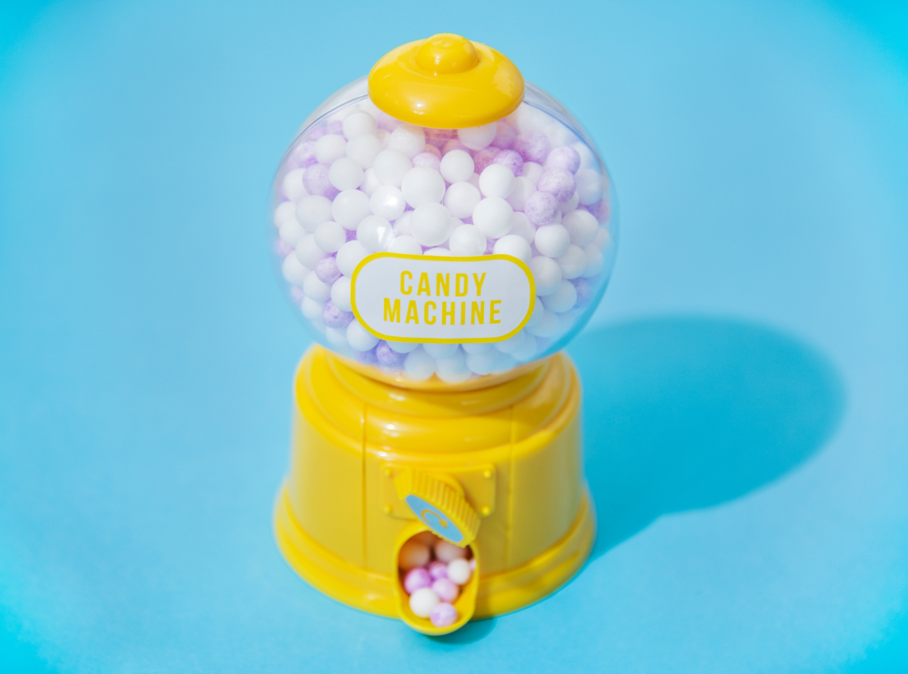

# How to code a simple website using Bootstrap  

  

This guide will teach you how to code a website like the one above.  

Before we get into things, here are some links to resources you might use during 
your web development:  
- https://getbootstrap.com/
- https://www.w3schools.com/
- https://pexels.com  

You'll also need a text editor like Visual Studio Code (which I use), Notepad++, 
or sublime.  

## Step 1: Create an HTML and CSS file in the same location
The **HTML** is what holds the content of the page, like text, photos, and links.  
The **CSS** is what styles the content of the page, so it has pretty colors and shadows.  
**Bootstrap** is a framework that simplifies coding a website by providing tools 
for making the structure and automatically adjusting for different browser sizes 
(don't you hate when a website loads weird on your desktop vs your phone?).  

Think of it like this: HTML is a blueprint of your rooms and furniture, CSS is an interior 
designer who places everything properly and decorates, and Bootstrap is a carpenter 
who helps make building simpler by providing pre-built arches, doors, etc.  

After creating your file, copy and paste the following boilerplate text into it. 
It's there so we have the files we need to use Bootstrap.  

```(html)
<!DOCTYPE html>
<html>

	<head>
		<meta charset="utf-8" />
		<meta http-equiv="X-UA-Compatible" content="IE=edge">
		<meta name="viewport" content="width=device-width, initial-scale=1">

		<!-- Our page's title and custom styling file -->
		<title>Your Title Here</title>
		<link rel="stylesheet" href="NAME_OF_YOUR_CSS_FILE.css" type="text/css">

		<!-- Bootstrap files -->
		<link rel="stylesheet" href="https://maxcdn.bootstrapcdn.com/bootstrap/4.0.0/css/bootstrap.min.css" integrity="sha384-Gn5384xqQ1aoWXA+058RXPxPg6fy4IWvTNh0E263XmFcJlSAwiGgFAW/dAiS6JXm" crossorigin="anonymous">
		<script src="https://code.jquery.com/jquery-3.2.1.slim.min.js" integrity="sha384-KJ3o2DKtIkvYIK3UENzmM7KCkRr/rE9/Qpg6aAZGJwFDMVNA/GpGFF93hXpG5KkN" crossorigin="anonymous"></script>
		<script src="https://cdnjs.cloudflare.com/ajax/libs/popper.js/1.12.9/umd/popper.min.js" integrity="sha384-ApNbgh9B+Y1QKtv3Rn7W3mgPxhU9K/ScQsAP7hUibX39j7fakFPskvXusvfa0b4Q" crossorigin="anonymous"></script>
		<script src="https://maxcdn.bootstrapcdn.com/bootstrap/4.0.0/js/bootstrap.min.js" integrity="sha384-JZR6Spejh4U02d8jOt6vLEHfe/JQGiRRSQQxSfFWpi1MquVdAyjUar5+76PVCmYl" crossorigin="anonymous"></script>
	</head>

	<body>

	</body>

</html>
```  

* The ``<head>`` section is the page's data and toolbox -- hence why you should 
change the title to what you want, and make sure your CSS files has the right name. *  

## Step 2: Lay out the structure of the site using Bootstrap tags
Bootstrap uses regular HTML tags like div, span, etc. but has built-in classes. 
If we're using the metaphor from before, these are the walls and arches. 

In the ``<body>`` section is where we put the construction plans. Note that spaces, 
tabs, and anything inside a ``<!-- comment -->`` line comment don't affect your code, 
so use them to organize your stuff. (Also, keep track of your opening and closing tags!)

```(html)
<body>

    <!-- Navbar (the thing at the top) -->

    <!-- Page content holder -->
    <div class="container-fluid">
        
        <!-- Main column where stuff goes -->
        <div class="col">

            <!-- About section -->
            <div class="row">

            </div>

            <!-- Photo section -->
            <div class="row">

            </div>

        </div>
    </div>

</body>
```

## Step 3: Build the navbar
The navbar is always a little difficult to understand, but luckily, we can just 
copy paste the premade navbar code from the Bootstrap site into our page, right 
below the navbar section we just made:  

```(html)
<!-- Navbar -->
<nav class="navbar navbar-expand-md navbar-light bg-light justify-content-center">
    
    <a class="navbar-brand d-flex w-50 mr-auto" href="#home">Your page's name!</a>

    <!-- This button replaces the links list when in mobile. -->
    <button class="navbar-toggler" type="button" data-toggle="collapse" data-target="#nav">
        <span class="navbar-toggler-icon"></span>
    </button>

    <!-- Navbar links -->
    <div class="collapse navbar-collapse" id="nav">
        <ul class="nav navbar-nav mr-auto justify-content-end">
            <li class="nav-item">
                <a class="nav-link" href="#about">About</a>
            </li>
            <li class="nav-item">
                <a class="nav-link" href="#photography">Photography</a>
            </li>
        </ul>
    </div>
</nav>
```  

## Step 4: About section
Now we have a navbar with a couple of links! Cool, huh?  
We need to make the stuff that the navbar links to. Under the about section we made, 
add the following:  

```(html)
<!-- About section -->
<div class="row" id="about"> <!-- Note: this id should match the href of the link in the navbar to link correctly -->

    <div class="col-3">
        
    </div>

    <div class="col-9">
        <h2>About Me</h2>

        <span class="align-middle">
            <p>Talk about your self here. I'm sure you're a very interesting person!
            </p>

            <p>Note that pressing enter 
            won't 
            put a line break. You either have to use a <br> line break to do that, or 
            start a new paragraph using new p tags.
            </p>
        </span>
    </div>

</div>
```  

Cool, now our About section has a beautiful selfie and some text about us. Now we 
ought to put a little stuff to show off our talents.  

## Step 5: Photo section
For the sake of this tutorial, we'll pretend we're photographers (and if you actually 
are one, then... you're doing great already!).  

```(html)
<!-- Photography section -->
<div class="row" id="photography">

    <div class="column-fluid" id="photodesc">

        <h2>Photography</h2>
        <p>Here are some photos I've taken.</p>

        <!-- Photo gallery -->

    </div>

</div>
```

Now we have an auto-expanding column where we can put a gallery. We'll build the 
photo gallery by using Bootstrap's built-in rows and columns grid system, which 
has 12 "units" horizontally where columns can be placed.  

```(html)
<!-- Photo gallery -->

<!-- top row -->
<div class="row">
    <div class="col-6">
        <div class="thumbnail">
            
        </div>
    </div>
    <div class="col-6">
        <div class="thumbnail">
            
        </div>
    </div>
</div>

<!-- bottom row -->
<div class="row">
    <div class="col-6">
        <div class="thumbnail">
            
        </div>
    </div>
    <div class="col-6">
        <div class="thumbnail">
            
        </div>
    </div>
</div>
```  

## Step 6: Spiff it up using CSS
By now, your website should look like this:  

  

and the code should look like this:  

```(html)
<!DOCTYPE html>
<html>

	<head>
		<meta charset="utf-8" />
		<meta http-equiv="X-UA-Compatible" content="IE=edge">
		<meta name="viewport" content="width=device-width, initial-scale=1">

		<!-- Our page's title and custom styling file -->
		<title>Page Title</title>
		<link rel="stylesheet" href="style.css" type="text/css">

		<!-- Bootstrap files -->
		<link rel="stylesheet" href="https://maxcdn.bootstrapcdn.com/bootstrap/4.0.0/css/bootstrap.min.css" integrity="sha384-Gn5384xqQ1aoWXA+058RXPxPg6fy4IWvTNh0E263XmFcJlSAwiGgFAW/dAiS6JXm" crossorigin="anonymous">
		<script src="https://code.jquery.com/jquery-3.2.1.slim.min.js" integrity="sha384-KJ3o2DKtIkvYIK3UENzmM7KCkRr/rE9/Qpg6aAZGJwFDMVNA/GpGFF93hXpG5KkN" crossorigin="anonymous"></script>
		<script src="https://cdnjs.cloudflare.com/ajax/libs/popper.js/1.12.9/umd/popper.min.js" integrity="sha384-ApNbgh9B+Y1QKtv3Rn7W3mgPxhU9K/ScQsAP7hUibX39j7fakFPskvXusvfa0b4Q" crossorigin="anonymous"></script>
		<script src="https://maxcdn.bootstrapcdn.com/bootstrap/4.0.0/js/bootstrap.min.js" integrity="sha384-JZR6Spejh4U02d8jOt6vLEHfe/JQGiRRSQQxSfFWpi1MquVdAyjUar5+76PVCmYl" crossorigin="anonymous"></script>
	</head>

	<body>

    <!-- Navbar -->
    <nav class="navbar navbar-expand-md navbar-light bg-light justify-content-center">
        
        <a class="navbar-brand d-flex w-50 mr-auto" href="#home">Your page's name!</a>

        <!-- This button replaces the links list when in mobile. -->
        <button class="navbar-toggler" type="button" data-toggle="collapse" data-target="#nav">
            <span class="navbar-toggler-icon"></span>
        </button>

        <!-- Navbar links -->
        <div class="collapse navbar-collapse" id="nav">
            <ul class="nav navbar-nav mr-auto justify-content-end">
                <li class="nav-item">
                    <a class="nav-link" href="#about">About</a>
                </li>
                <li class="nav-item">
                    <a class="nav-link" href="#photography">Photography</a>
                </li>
            </ul>
        </div>
    </nav>

    <!-- Page content holder -->
    <div class="container-fluid">
        
        <!-- Main column where stuff goes -->
        <div class="col">

            <!-- About section -->
            <div class="row" id="about"> <!-- Note: this id should match the href of the link in the navbar to link correctly -->

                <div class="col-3">
                    
                </div>

                <div class="col-9">
                    <h2>About Me</h2>

                    <span class="align-middle">
                        <p>Talk about your self here. I'm sure you're a very interesting person!
                        </p>

                        <p>Note that pressing enter 
                        won't 
                        put a line break. You either have to use a <br> line break to do that, or 
                        start a new paragraph using new p tags.
                        </p>
                    </span>
                </div>

            </div>

            <!-- Photography section -->
            <div class="row" id="photography">

                <div class="column-fluid" id="photodesc">

                    <h2>Photography</h2>
                    <p>Here are some photos I've taken.</p>

                    <!-- Photo gallery -->

                </div>

            </div>

            <!-- top row -->
            <div class="row">
                <div class="col-6">
                    <div class="thumbnail">
                        
                    </div>
                </div>
                <div class="col-6">
                    <div class="thumbnail">
                        
                    </div>
                </div>
            </div>

            <!-- bottom row -->
            <div class="row">
                <div class="col-6">
                    <div class="thumbnail">
                        
                    </div>
                </div>
                <div class="col-6">
                    <div class="thumbnail">
                        
                    </div>
                </div>
            </div>

        </div>
    </div>

</body>

</html>
```  

As you can see from the photo, it looks kinda wack. So let's make it fancier using 
CSS. Unlike HTML, CSS doesn't require boilerplate, so just open it and let's add 
some stuff:  

```(css)
/* This is a comment. It doesn't affec the code and is helpful for organization. */

/* Make the navbar links sliiide to their targets, instead of jumping: */
html {
    scroll-behavior: smooth;
}

/* Color the background and add some space to the sides of the main column: */
.container-fluid {
    background-color: #F8B003;
    padding-left: 10% !important;
    padding-right: 10% !important;
}

/* Put a nice frame around all images on the page: */
img {
    border: 4px solid white;
    border-radius: 4px;
    box-shadow: 0px 4px 8px rgba(17,17,17,0.2);
}

/* Color the second section (photography): */
#photography {
    background-color: whitesmoke;
}

/* Space out the photos in our gallery a little: */
.thumbnail {
    padding: 4%;
}
```

And the final result is (image a drum roll here):  

  

Voila! I'll add more on how to do on my personal website in the time to come.  
Have a good one!  